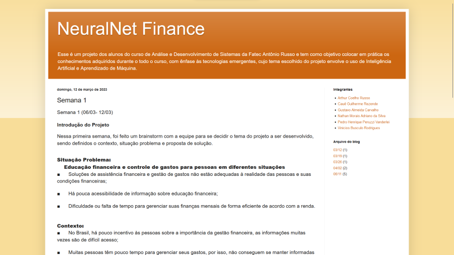
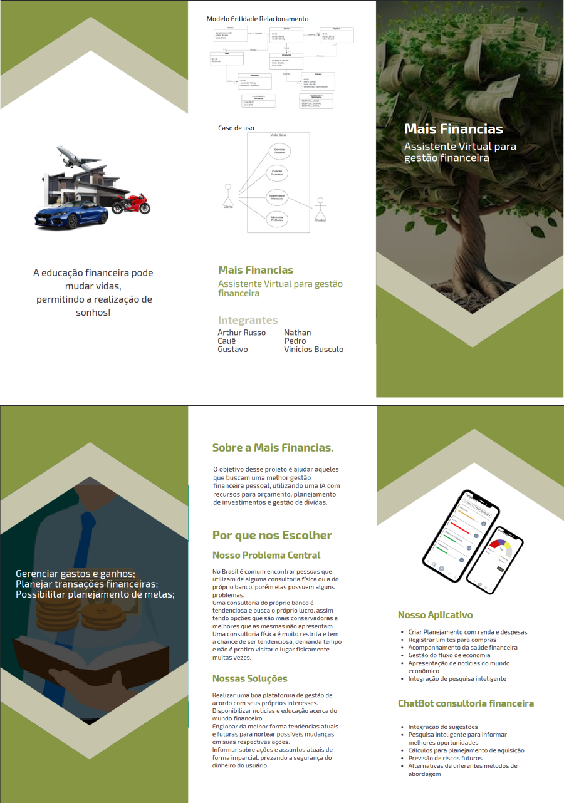

# Principais Entregas e Eventos

Este documento serve como um registro cronológico das principais entregas e eventos do projeto Mais Finanças.

## Blog - 06/03

Criado o [blog](https://nnmaisfinancas.blogspot.com) da equipe a fim de registrar atividades e atualizações do projeto.

## Prototipação - 19/03

Modelos visuais para demonstração das funcionalidades através do design das interfaces do aplicativo mobile.

## Especificação da Solução - 09/04

Documento da [Especificação da solução](./assets/Especificação%20da%20Solução.pdf), contendo os seguintes tópicos:

- Detalhamento das necessidades do cliente
- Requisitos funcionais e não funcionais
- Diagramas de casos de uso
- Diagrama de classes

## Folder - 09/04

O folder do projeto foi criado para divulgação.

## Proposta Técnica - 23/04

O documento da [Proposta Técnica](./assets/Proposta%20Técnica.pdf) reúne todos os artefatos produzidos durante a fase de planejamento

- Contextualização
- Solução Técnica
- Modelagem funcional
- Protótipos
- Arquitetura
- Plano de Testes

foi elaborado, detalhando a solução técnica do projeto e artefatos produzidos durante a fase de planejamento, incluindo arquitetura de solução, ferramentas.

## Repositório do Projeto - 07/05

O repositório do projeto foi criado para armazenar o código-fonte das aplicações.

Na primeira fase do projeto, foram desenvolvidos os artefatos para a elaboração da PoC do projeto, dos quais é possível constar:

- Validação de uma pipeline para simplificar o processo de transição entre desenvolvimento local e implantação das aplicações.
- Desenvolvimento da aplicação Web com Next.js
- Integração do chatbot com as aplicações web e mobile.

Link do repositório: <https://github.com/mais-financas>

## Apresentação da PoC (Prova de Conceito) - 10/06

- [x] Demonstração bem-sucedida da integração do chatbot das aplicações Web e Mobile.
- [x] Validação da pipeline de Integração Contínua (CI) na API do projeto.
